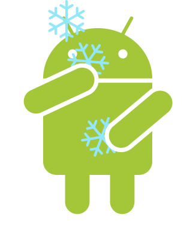

# Dr Freeze

  <big><b>This app needs root access to work</b></big>

This app allows you to disable and enable on the fly other applications.
As a result, theses disabled applications won't be able to send any informations to trackers.

However, some drawbacks exists as the application is disabled:
- You will not receive any notifications when the application is disabled (which is normal :D)
- The app will not appear in the launcher. But you can use the shortcus provided by Dr Freeze to launch the app
- You will not be able to update disabled application. In order to update apps, you have to enable it first
## Functionalities

| List Apps | Manage apps |
| ------------- | ------------- |
|   |   |
| Notifications  | Shortcuts  |
|   |   |
